#### 运行终端截图

### 输出结果的简要描述

该项目使用yolov10模型对数据集Seaships中的1750张船舶图片进行训练，同时进行了验证和测试。在本次训练中，船舶共分为六类，进行了60次epoch，为了加快运行速度batch设置为8，同时为了提高检测精度将imgsz设置为800，lr0和lrf均为0.01，运行结果如下图所示。

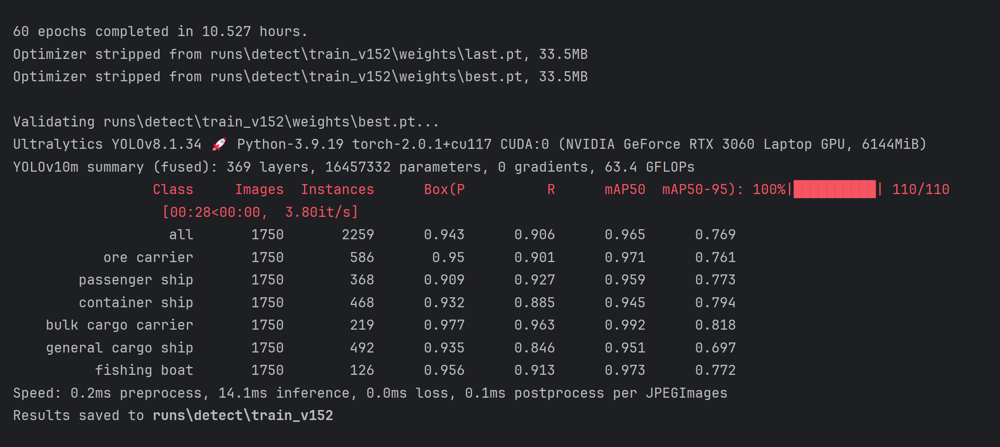

  图1

> 在置信度为0.488时，F1得分达到最大值0.92。

如上图所示，六类船舶精确度的平均值为0.943，召回率为0.906,在IoU阈值为0.5时，模型的平均精度均值为0.965，在IoU阈值为0.5到0.95时，平均精度均值为0.769。训练出来的模型具有较好的效果。

> **（补充：最近看了一些缺陷识别领域的论文，因此除了对Seaships数据集进行目标检测之外，也对NEU-DET数据集进行了缺陷检测，详细代码和运行结果也在仓库中。）**

### 以下是输出目录的内容

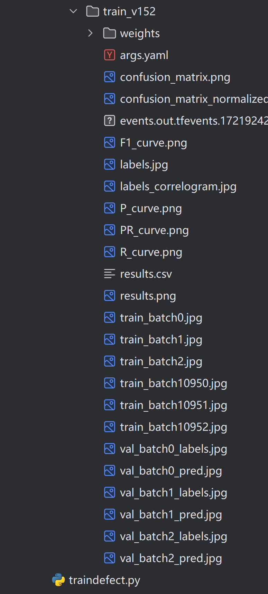

  图2

**1.weight文件夹**：中的best.pt和last.pt分别是损失值最小的模型文件和训练到最后的模型文件。

**2.args.yaml：** 模型训练的配置参数

**3.confusion_matrix.png - 混淆矩阵**  对角线上的数值较高，表示模型正确预测的数量较多。

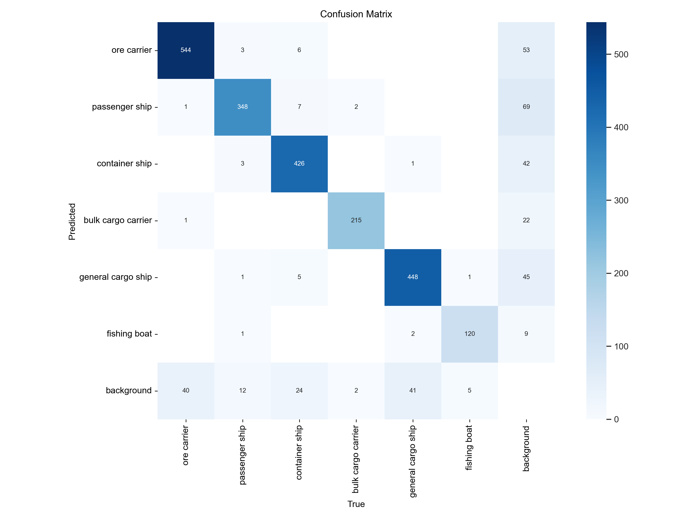

  图3

**4.confusion_matrix_normalized.png**则是图三归一化后的结果。

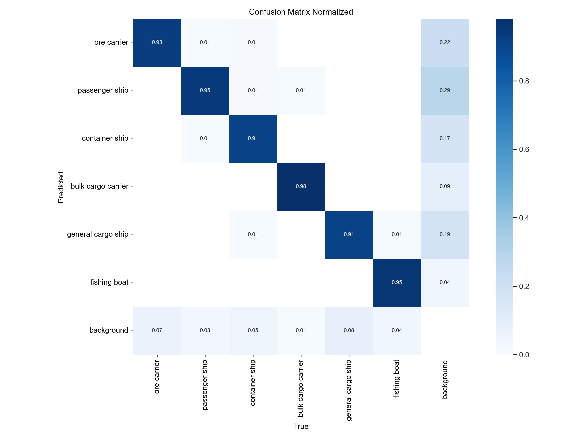

  图4

**5.F1_curve.png - F1-置信度曲线 ** 此曲线显示了F1得分随着置信度阈值的变化。F1得分是精确度和召回率的调和平均值，在置信度为0.488的时候F1得分达到最大值0.92。

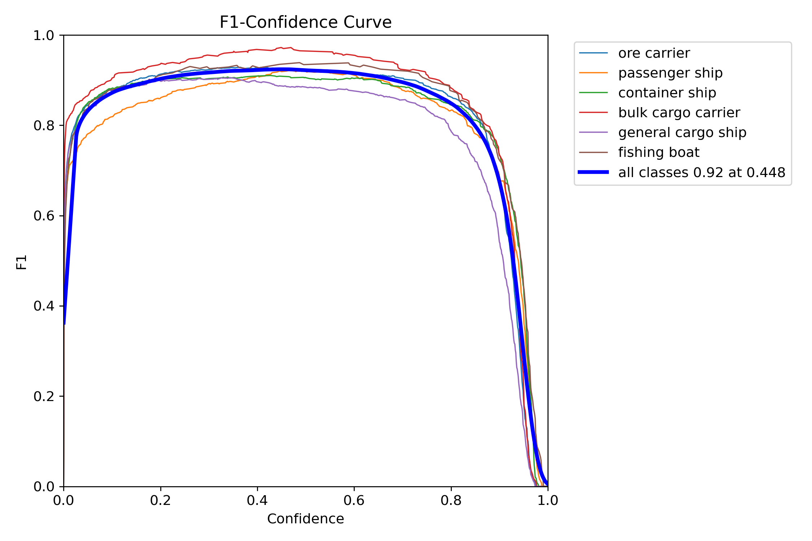

  图5

**6.labels.jpg - 标签分布图和边界框分布图**  柱状图显示了六类船舶的实例分布数量。散点图则展示了训练时边界框的空间分布情况

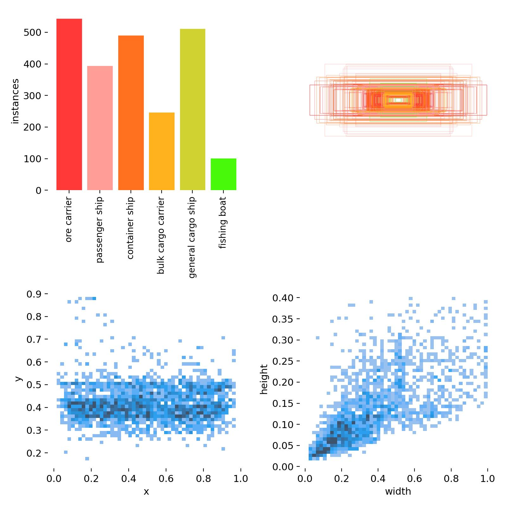

  图6

**7.labels_correlogram.jpg - 标签相关图 ** 提供了不同类别标签之间的关系，以及它们在图像中位置的相关性

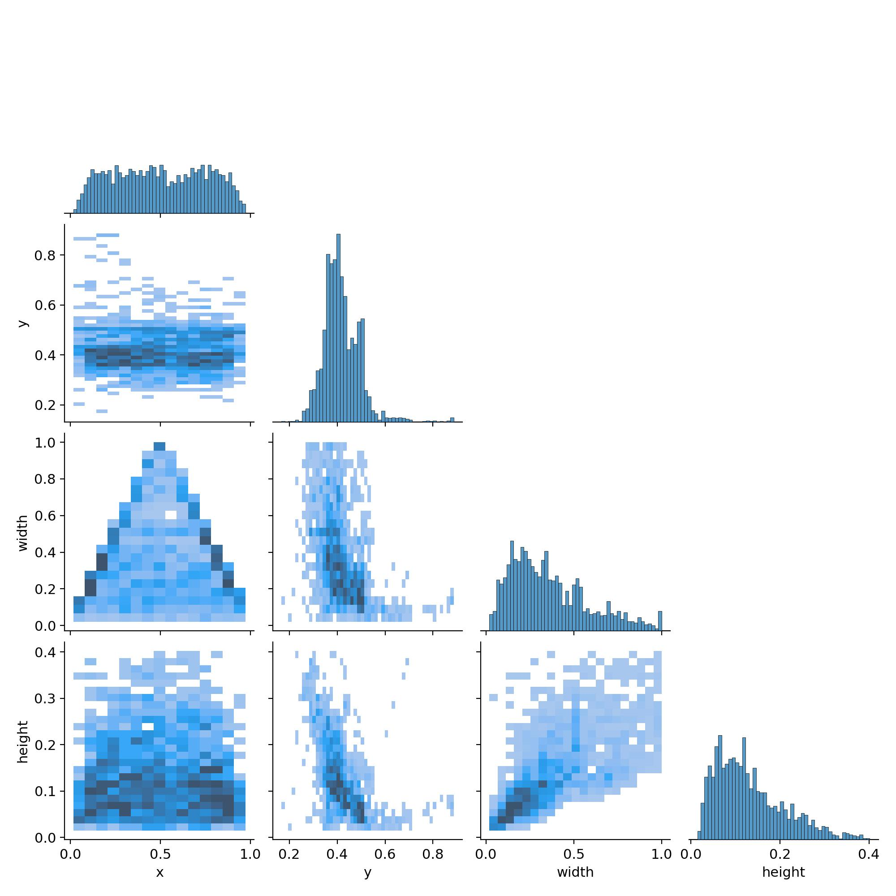

  图7

**8.P_curve.png - 精确度-置信度曲线**  展示了模型预测的精确度随着置信度的变化，在置信度为0.975的时候，精确度为1

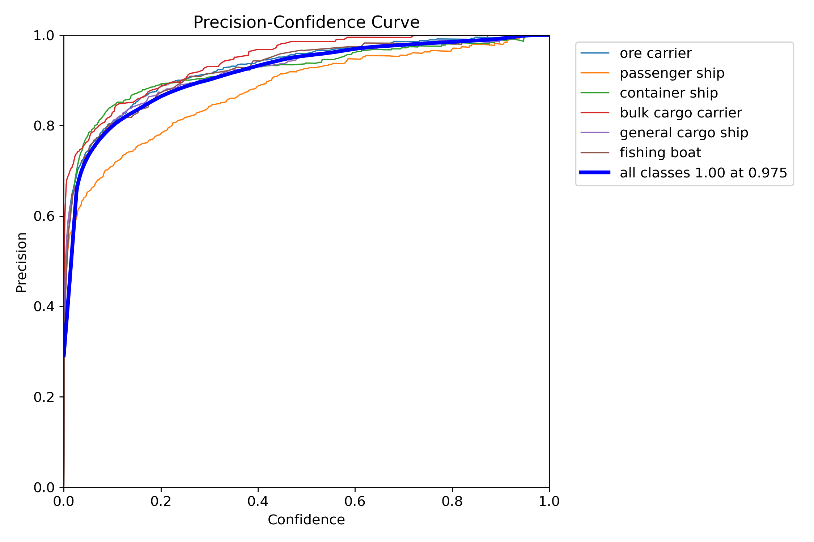

  图8

**9.PR_curve.png - 精确度-召回曲线**  展示了模型在IoU为0.5时,精确度与召回率之间的关系（平均精度均值）

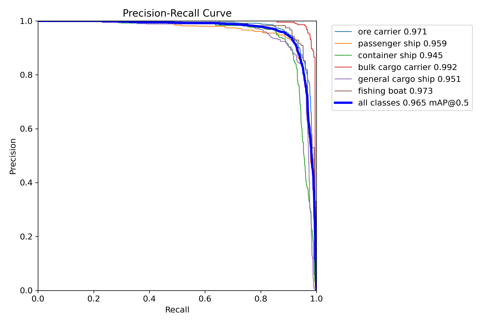

  图9

**10.R_curve.png - 召回-置信度曲线**  显示了模型的召回率随置信度阈值的变化。召回率是模型正确预测的正例与实际正例总数的比值。

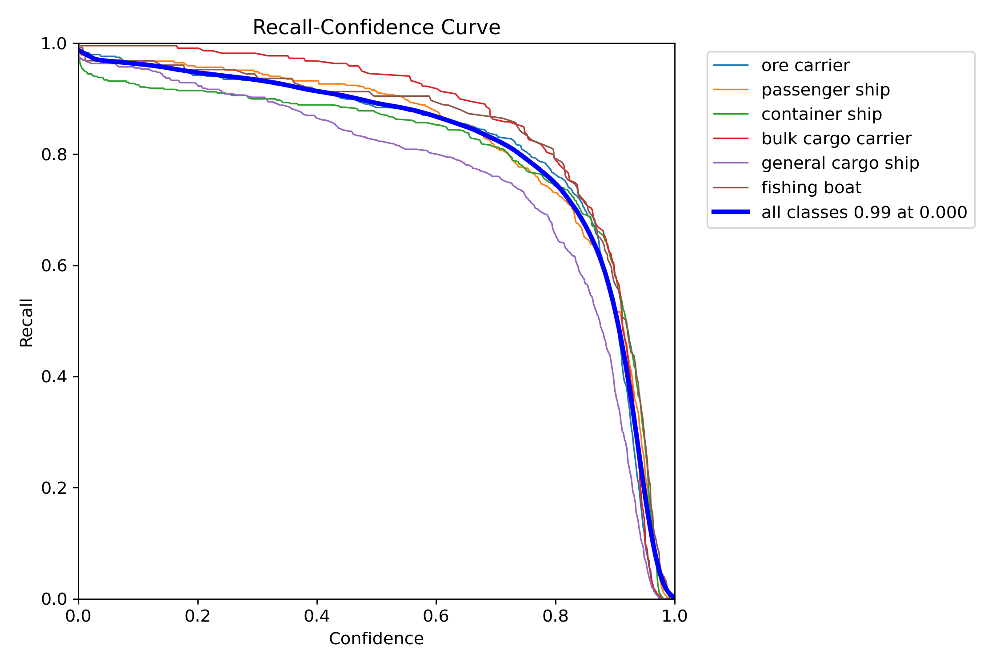

  图10

**11.results.png 和 results.csv - 训练结果图表和数据**  展示了模型在训练过程中的性能变化，随着epochs的增加，边界框损失、分类损失、分布式聚焦损失呈下降趋势，召回率、mAP、精度呈上升趋势，说明了模型的准确度得到了提升。

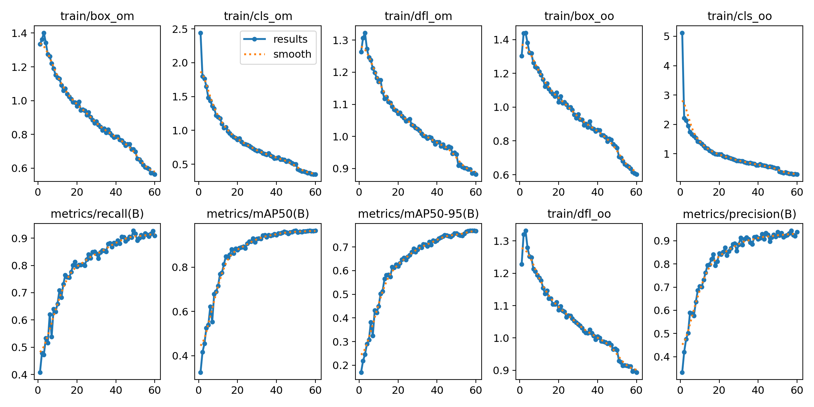

  图11

**12.train_batch** 是指模型训练过程中所出来的一批图片。这些图片在训练前会经过数据增强的操作,如随机裁剪、旋转、缩放等,以增加模型的鲁棒性和泛化能力。

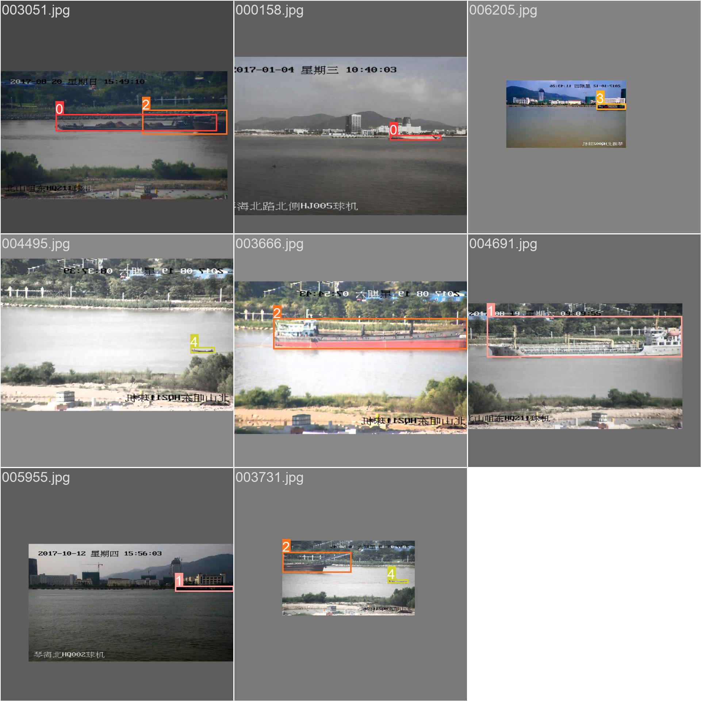

  图12

**13.val_batch** 是在验证过程中处理的第一个验证批次。

**val_batch1_labels**  只含有船的类别

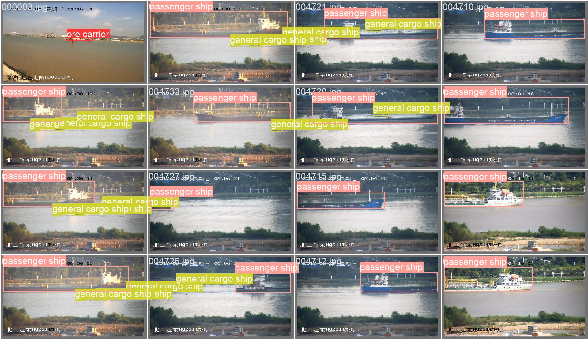

  图13

**val_batch1_pre**   含有船的类别和置信度大小

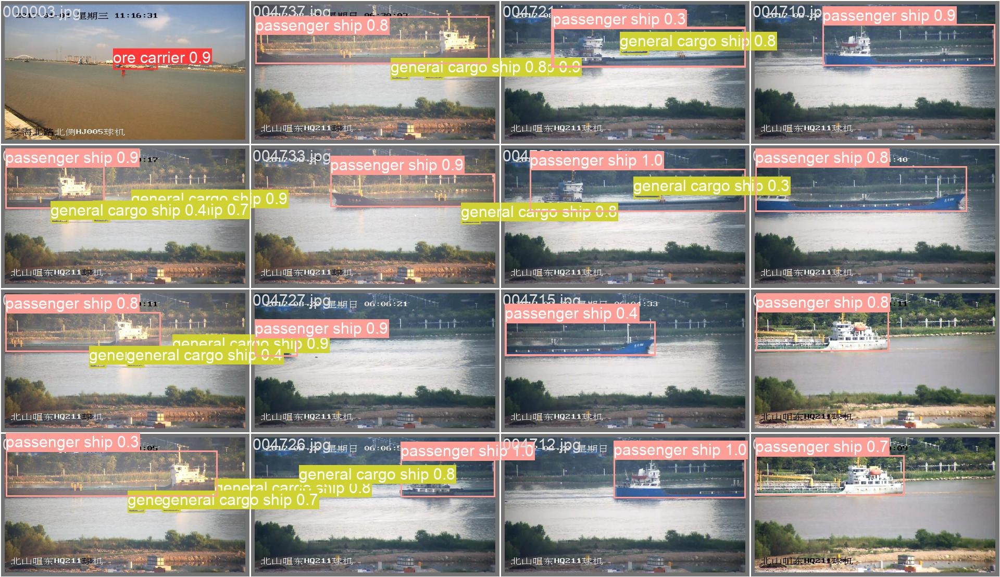

  图14