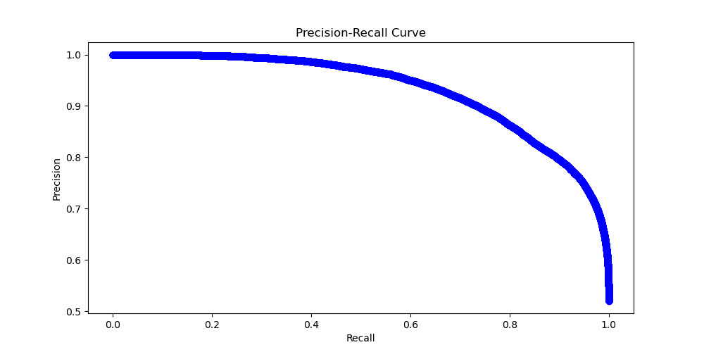

## 说明文档

### 1. 概述

> 本文档描述了一个基于PaddlePaddle的LSTM（长短时记忆网络）模型的训练和推理过程。该模型用于处理词嵌入数据，以分类任务为目标。以下部分详细介绍了数据处理、模型结构、损失函数、训练过程、测试结果等关键要点。
>
> 通过网络搜集资料发现大多情感分析案例都是基于影评和购物网站评论的, 对于动漫评论的情感分析几乎没有相关的案例出现; 
>
> 动漫是本人的爱好之一,通过学习基于fluid的情感分析来进行B站动漫的情感分析.

该项目是一个基于Paddle深度学习框架的LSTM（长短时记忆网络）模型的训练和预测，模型通过学习基于Paddle.fluid的情感分析来进行B站评论的情感分析。

本项目中的数据集是在网上查到的B站评论数据集, 数据集中word_dict.txt为词典数据, train_data.txt为训练数据, test_data.txt为测试数据集。代码基于Paddle框架进行了修改和优化，增加了Adam 优化器以及Dropout 层。该模型进行了150次epoch，发现模型在训练到20次的时候准确度达0.9左右，并且不再进行增加。

### 2. 数据处理

#### 2.1 数据加载
**词典加载**: 从`word_dict.txt`文件中加载词典数据，词典用于词嵌入层，将词汇映射到词向量。

```python
# 加载词典数据
with io.open("word_dict.txt", "r", encoding="utf-8") as input:
    word_dict = eval(input.read())
    print(len(word_dict))
```

**数据生成器**: `train_generator`和`test_generator`函数从`train_data.txt`文件中加载训练数据和测试数据。这些数据包括词向量和对应的标签。

```python
def train_generator():
    with io.open("train_data.txt", "r", encoding="utf-8") as output:
        train_data = eval(output.read())
        print(len(train_data))
    def reader():
        for word_vector, label in train_data:
            yield word_vector, label
    return reader

# 测试集生成器
def test_generator():
    with io.open("train_data.txt", "r", encoding="utf-8") as output:
        test_data = eval(output.read())
        print(len(test_data))
    def reader():
        for word_vector, label in test_data:
            yield word_vector, label
    return reader

```

#### 2.2 数据批处理
**批处理**: 使用PaddlePaddle的`paddle.batch`函数将数据分批处理，并通过`paddle.reader.shuffle`对训练数据进行打乱，以减少数据之间的相关性。

```python
# 数据分Batch处理, 并打乱减少相关性束缚,放数据进显卡
train_reader = paddle.batch(
    paddle.reader.shuffle(
        train_generator(),
    buf_size=51200),
    batch_size=BATCH_SIZE)
test_reader = paddle.batch(
    test_generator(),
    batch_size=BATCH_SIZE)
for data in test_reader():
            print(data)
            print(len(data))
dict_dim = len(word_dict)
```

### 3. 模型结构（LSTM 网络）

**词嵌入层**: 使用`fluid.layers.embedding`将词索引转换为词向量，维度由`dict_dim`（词典大小）和`emb_dim`（词嵌入维度）指定。

```python
# 词嵌入层
    emb = fluid.layers.embedding(
        input=data,
        size=[dict_dim, emb_dim],
        param_attr=fluid.ParamAttr(learning_rate=emb_lr))
```

**全连接层**: 使用`fluid.layers.fc`将词嵌入的输出映射到更高维度，`size=hid_dim * 4`。

```python
 # 全连接层
    fc0 = fluid.layers.fc(input=emb, size=hid_dim * 4)

```

**LSTM 层**: 使用`fluid.layers.dynamic_lstm`构建LSTM层，输出`lstm_h`和`c`。`lstm_h`用于后续的池化操作。

```python
 # LSTM 层
    lstm_h, c = fluid.layers.dynamic_lstm(
        input=fc0, size=hid_dim * 4, is_reverse=False)

```

**池化层**: 使用`fluid.layers.sequence_pool`对LSTM的输出进行最大池化操作，提取最重要的特征。

```python
 # 池化层
    lstm_max = fluid.layers.sequence_pool(input=lstm_h, pool_type='max')
    lstm_max_tanh = fluid.layers.tanh(lstm_max)

```

**全连接层**: 使用`fluid.layers.fc`将池化后的输出映射到分类维度`class_dim`（分类数）。

```python
# 全连接层
    prediction = fluid.layers.fc(input=dropout, size=class_dim, act='softmax')

```

**Dropout 层**: 使用`fluid.layers.dropout`增加Dropout层以减少过拟合。

```python
  # Dropout层
    fc1 = fluid.layers.fc(input=lstm_max_tanh, size=hid_dim2, act='tanh')
    dropout = fluid.layers.dropout(x=fc1, dropout_prob=0.5)

```

### 4. 损失函数和优化器

#### 4.1 损失函数
**交叉熵损失**: 使用`fluid.layers.cross_entropy`计算预测值和真实标签之间的交叉熵损失。

```python
cost = fluid.layers.cross_entropy(input=prediction, label=label)
avg_cost = fluid.layers.mean(x=cost)
```

#### 4.2 优化器
**Adam 优化器**: 使用`fluid.optimizer.Adam`优化模型的训练过程，通过最小化损失函数来更新模型参数。

```python
# 使用Adam优化器
sgd_optimizer = fluid.optimizer.Adam(learning_rate=lr)
sgd_optimizer.minimize(cost)
```

### 5. 训练过程

**定义训练函数**: 对于每个epoch，计算平均损失和准确率。保存训练过程中的损失、准确率、精确度、召回率和F1分数。

```python
# 训练函数
def train(train_reader, word_dict, network, use_cuda, save_dirname, lr=0.001, batch_size=16, pass_num=10):
    # 输入层
    data = fluid.layers.data(name="words", shape=[1], dtype="int64", lod_level=1)
    # 标签层
    label = fluid.layers.data(name="label", shape=[1], dtype="int64")
    # 网络结构
    cost, acc, prediction = network(data, label, len(word_dict))

    # 使用Adam优化器
    sgd_optimizer = fluid.optimizer.Adam(learning_rate=lr)
    sgd_optimizer.minimize(cost)
    # 设备、执行器、feeder 定义
    place = fluid.CUDAPlace(0) if use_cuda else fluid.CPUPlace()
    exe = fluid.Executor(place)
    feeder = fluid.DataFeeder(feed_list=[data, label], place=place)
    # 模型参数初始化
    exe.run(fluid.default_startup_program())

    # 保存训练过程中的损失值、准确率、精确度、召回率和F1分数
    losses, accs = [], []
    for pass_id in range(pass_num):
        epoch_loss, epoch_acc, epoch_count = 0.0, 0.0, 0
        for batch_id, data in enumerate(train_reader()):
            loss, acc = exe.run(
                fluid.default_main_program(),
                feed=feeder.feed(data),
                fetch_list=[cost, acc])
            epoch_loss += np.mean(loss)
            epoch_acc += np.mean(acc)
            epoch_count += 1

        # 保存训练过程中的损失值和准确率
        losses.append(epoch_loss / epoch_count)
        accs.append(epoch_acc / epoch_count)
        print("Pass %d, loss= %.5f, acc= %.5f" % (pass_id, epoch_loss / epoch_count, epoch_acc / epoch_count))
```

**保存模型**: 使用`fluid.io.save_inference_model`保存训练好的模型。

```python
    # 保存模型
    fluid.io.save_inference_model(save_dirname, feeded_var_names=["words"], target_vars=[prediction], executor=exe)
```

**绘图**: 保存训练过程中的损失值、准确率、精确度、召回率和F1分数的曲线图，以及精确率-召回率曲线和ROC曲线。

```python
# 绘制损失值、准确率、精确度、召回率、F1分数曲线
    plt.figure()
    #损失值
    plt.plot(range(pass_num), loss_values, label='Loss')
    plt.xlabel('Epoch')
    plt.ylabel('Loss')
    plt.title('Loss Curve')
    plt.legend()
    plt.savefig("C:\\Users\\ljx20\\Documents\\code\\image\\loss_curve.png")
    plt.close()
    ..........
```

**调用训练函数训练模型**

```python
train(
    train_reader,
    word_dict,
    lstm_net,
    use_cuda=False,
    save_dirname="lstm_model",
    lr=0.001,
    pass_num=150,
    batch_size=16)
```


### 6. 测试

#### **6.1定义测试过程**

**设置输入层和标签层**

```python
    # 输入层
    data = fluid.layers.data(
        name="words", shape=[1], dtype="int64", lod_level=1)

    # 标签层
    label = fluid.layers.data(name="label", shape=[1], dtype="int64")
```

**设置设备 和 执行器**

```python
  place = fluid.CUDAPlace(0) if use_cuda else fluid.CPUPlace()
    exe = fluid.Executor(place)
    feeder = fluid.DataFeeder(feed_list=[data, label], place=place)
```

**创建并使用 scope**

```python
    inference_scope = fluid.core.Scope()  
```

**加载测试模型**

```python
        [inference_program, feed_target_names,
         fetch_targets] = fluid.io.load_inference_model(model_path, exe)
        total_acc = 0.0
        total_count = 0
        for data in test_reader():
```

**预测**

```python
  acc = exe.run(inference_program,
                          feed=feeder.feed(data),
                          fetch_list=fetch_targets,
                          return_numpy=True)
            total_acc += acc[0] * len(data)
            total_count += len(data)

        avg_acc = total_acc / total_count
        print("model_path: %s, avg_acc: %f" % (model_path, avg_acc))
```

**执行预测**: 对测试数据进行预测，并计算平均准确率。

```python
model_path = "lstm_model"
infer(test_reader, use_cuda=False, model_path=model_path)  
```

### 7.结果

#### 7.1运行终端结果

4359表示词典数据（word_dict）长度, 7732表示训练数据（train_data）长度。

该模型进行了150次epoch，发现模型在训练到20次的时候准确率达0.91左右，并且不再进行增加。由此推测该模型的最大准确率为0.91。由下方部分曲线同样得知，在训练20次之后，曲线趋于平缓，无法通过增加训练次数来提高准确率和精确率。对测试集进行测试结果表明，测试的平均准确率为0.917，具有较好的测试结果。


#### 7.1输出图片

**混淆矩阵**          **class0**代表积极情感，喜爱、满意、快乐、兴奋等。  **class1**代表消极情感，厌恶、愤怒、悲伤、失望等。


**准确率曲线**


**F1曲线**


**训练损失曲线**


**精确率曲线**


**召回率曲线**


**精确率-召回率曲线**




**ROC曲线**评估二分类模型的性能，展示了不同阈值下的真阳性率和假阳性率的关系。在该曲线中，横轴代表假阳性率（FPR），纵轴代表真正阳性率（TPR），该ROC曲线的面积为0.97，表明模型具有较高的分类准确度。

