#### python深度学习的几种框架

1. TensorFlow
2. PyTorch
3. Keras
4. Caffe
5. Theano

## Pytorch

### 1 加载数据主要涉及两个类，Dataset（数据集），Dateloader（数据装载器）

#### 1.1 Dataset

抽象概念：提供一种方式获取数据中的某个种类的数据(data)和标签（label)并进行编号

功能：

1.如何获取每一个数据集及其label

2.告诉我们总共有多少数据


#### 1.2dataloader

抽象概念：为后面的网络提供不同的数据形式


### 2 transforms结构及用法

#### 2.1transforms.py工具箱

totensor，resize等各种工具

流程：图片——>工具——>结果

tensor数据类型包括了反向神经网络所需要的理论基础的参数


### 3 Python中______call______的作用

```python
class Person:
    def __call__(self,name):
        print("__call__"+"Hello"+name)
        
    def hello(self,name):
        print("hello"+name)
        
p1=Person()
p1("zhangsan")#使用对象可以直接调用call函数，不需要person.call("zhangsan")
p1.hello("lisi")
```


### 4 Pytorch官方文档

#### 4.1官方文档的几个模块

pytorch 核心模块[PyTorch](https://pytorch.org/docs)

语音方面[torchaudio](https://pytorch.org/audio)

文本方面[torchtext](https://pytorch.org/text)

视觉图像[torchtext](https://pytorch.org/text)

分布式环境中进行弹性训练的库[TorchElastic](https://pytorch.org/elastic/)

用于部署 PyTorch 模型的库[TorchServe](https://pytorch.org/serve)

使 PyTorch 能够在谷歌的 Tensor Processing Units (TPUs) 和其他 XLA（加速线性代数）设备上运行[PyTorch on XLA Devices](http://pytorch.org/xla/)

#### 4.2PyTorch 生态系统中包含了多个库，每个库都有其特定的功能和应用场景。

1. **PyTorch**:
   - 核心库，提供了张量操作、自动微分、神经网络构建等基础功能。用于构建和训练深度学习模型。
2. **torchaudio**:
   - 用于处理音频数据的库，提供了音频加载、预处理、特征提取等功能。适用于语音识别、音频分类等任务。
3. **torchtext**:
   - 用于自然语言处理（NLP）的库，提供了文本数据的加载、预处理、词嵌入等功能。适用于文本分类、机器翻译等任务。
4. **torchvision**:
   - 用于计算机视觉的库，提供了图像和视频数据集、数据预处理、常用的预训练模型（如 ResNet、VGG）等功能。适用于图像分类、目标检测、图像分割等任务。
5. **TorchElastic**:
   - 用于在分布式环境中进行弹性训练的库，支持在工作节点故障时自动恢复训练。适用于大规模分布式深度学习训练。
6. **TorchServe**:
   - 用于部署 PyTorch 模型的库，提供了高性能、灵活的模型服务功能。适用于将训练好的模型部署为 Web 服务，支持推理请求。
7. **PyTorch on XLA Devices**:
   - 使 PyTorch 能够在谷歌的 Tensor Processing Units (TPUs) 和其他 XLA（加速线性代数）设备上运行。提供了高效的硬件加速支持，适用于需要大量计算资源的深度学习任务。

这些库组成了 PyTorch 的生态系统，使得用户可以在各种应用场景中灵活地使用 PyTorch 进行深度学习模型的构建、训练和部署。

### 4.3TORCH.NN

来自神经网络的缩写，Neural network

These are the basic building block for graphs

### Containers

- 容器类，用于组织和管理不同的神经网络模块。

### Convolution Layers

- 卷积层，用于应用卷积操作来提取特征。

### Pooling Layers

- 池化层，用于降低特征图的尺寸，同时保留重要特征。

### Padding Layers

- 填充层，用于在输入数据的边缘添加额外的像素。

### Non-linear Activations (weighted sum, nonlinearity)

- 非线性激活函数，用于引入非线性特性。

### Non-linear Activations (other)

- 其他类型的非线性激活函数。

### Normalization Layers

- 归一化层，用于标准化输入数据的分布。

### Recurrent Layers

- 循环神经网络层，用于处理序列数据。

### Transformer Layers

- Transformer层，用于处理序列数据和自注意力机制。

### Linear Layers

- 线性层，用于线性变换输入数据。

### Dropout Layers

- 随机失活层，用于防止过拟合。

### Sparse Layers

- 稀疏层，用于稀疏数据的处理。

### Distance Functions

- 距离函数，用于计算向量之间的距离。

### Loss Functions

- 损失函数，用于评估模型预测的误差。

### Vision Layers

- 视觉层，用于计算机视觉任务。

### Shuffle Layers

- 打乱层，用于随机打乱输入数据。

### DataParallel Layers (multi-GPU, distributed)

- 数据并行层，用于在多GPU或分布式环境中训练模型。

### Utilities

- 工具类函数，用于各种辅助功能。

### Quantized Functions

- 量化函数，用于量化神经网络。

### Lazy Modules Initialization

- ###### 延迟模块初始化，用于在第一次使用时初始化模块。


- [Containers](https://pytorch.org/docs/1.8.1/nn.html#containers)  容器（骨架）定义了神经网络的骨架/结构：往骨架中添加内容，可以组成神经网络
- [Convolution Layers](https://pytorch.org/docs/1.8.1/nn.html#convolution-layers)
- [Pooling layers](https://pytorch.org/docs/1.8.1/nn.html#pooling-layers)
- [Padding Layers](https://pytorch.org/docs/1.8.1/nn.html#padding-layers)
- [Non-linear Activations (weighted sum, nonlinearity)](https://pytorch.org/docs/1.8.1/nn.html#non-linear-activations-weighted-sum-nonlinearity)
- [Non-linear Activations (other)](https://pytorch.org/docs/1.8.1/nn.html#non-linear-activations-other)
- [Normalization Layers](https://pytorch.org/docs/1.8.1/nn.html#normalization-layers)
- [Recurrent Layers](https://pytorch.org/docs/1.8.1/nn.html#recurrent-layers)
- [Transformer Layers](https://pytorch.org/docs/1.8.1/nn.html#transformer-layers)
- [Linear Layers](https://pytorch.org/docs/1.8.1/nn.html#linear-layers)
- [Dropout Layers](https://pytorch.org/docs/1.8.1/nn.html#dropout-layers)
- [Sparse Layers](https://pytorch.org/docs/1.8.1/nn.html#sparse-layers)
- [Distance Functions](https://pytorch.org/docs/1.8.1/nn.html#distance-functions)
- [Loss Functions](https://pytorch.org/docs/1.8.1/nn.html#loss-functions)
- [Vision Layers](https://pytorch.org/docs/1.8.1/nn.html#vision-layers)
- [Shuffle Layers](https://pytorch.org/docs/1.8.1/nn.html#shuffle-layers)
- [DataParallel Layers (multi-GPU, distributed)](https://pytorch.org/docs/1.8.1/nn.html#dataparallel-layers-multi-gpu-distributed)
- [Utilities](https://pytorch.org/docs/1.8.1/nn.html#utilities)
- [Quantized Functions](https://pytorch.org/docs/1.8.1/nn.html#quantized-functions)
- [Lazy Modules Initialization](https://pytorch.org/docs/1.8.1/nn.html#lazy-modules-initialization)


**1.**opencv读取的数据类型为numpy型

**2.**通常情况下PIL使用的颜色通道顺序是RGB（红绿蓝），而OpenCV使用的是BGR（蓝绿红）

**3.**

```python
from torch.utils.tensorboard import SummaryWriter
```

**库**：`torch` 是 PyTorch 库，PyTorch 是一个用于深度学习的开源机器学习库。

**模块**：`torch.utils.tensorboard` 是一个模块。它是 PyTorch 库中 `utils` 子模块下的 `tensorboard` 模块，用于与 TensorBoard 集成。

**类**：`SummaryWriter` 是 `torch.utils.tensorboard` 模块中的一个类。它用于记录各种类型的数据，以便在 TensorBoard 中可视化。

**4.**

```python
from PIL import Image
```

**库**：`PIL`，即 Python Imaging Library，是一个用于图像处理的库。不过，PIL 已经停止维护，Pillow 是它的一个社区驱动的分支和继承者。通常在使用 Pillow 时仍然会看到 PIL 作为兼容的名称。

**模块**：`Image` 是 PIL 库中的一个模块。它包含了用于打开、操作和保存图像的各种类和函数。

5.pytorch的归一化标准化？？那个是归一化那个是标准化，如何计算？？

**归一化（Normalization）**：将数据缩放到固定范围（如0到1）。

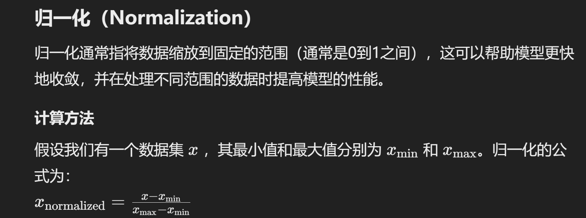

**标准化（Standardization）**：将数据转换为均值为0、标准差为1的分布。

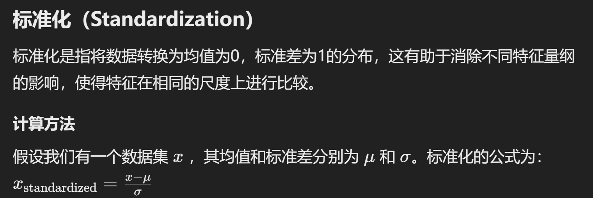

6.如何阅读库

（1）关注输入和输出类型

（2）多看官方文档

（3）关注方法需要什么参数

（4）不知道返回值的时候，可以print或者print(type())或者debug

（5）sigmord和relu激活函数

7.p13什么意思

8.卷积核=滤波器=kernel。。权重=weights

9.MaxPool最大池化，有时候也成为下载量/下采样

最大池化的优点

降低计算复杂度

- 通过减小特征图的尺寸，减少了后续层的计算量。

防止过拟合

- 通过减少特征图的尺寸和参数数量，可以减轻模型的过拟合问题。

保持重要特征

- 最大池化保留了特征图中最显著的特征，有助于模型更好地识别图像中的重要模式。

10.卷积的本质是为了提取图片特征，最大池化的作用是为了提取图片特征的同时减小数据量，加快计算速度

11.卷积层默认步长stride为1

12.池化层的默认步长stride是滑动窗口的大小kernel_size

13.池化层的**ceil_mode**参数，若为True，则允许有出界部分，若为False（floor）则不允许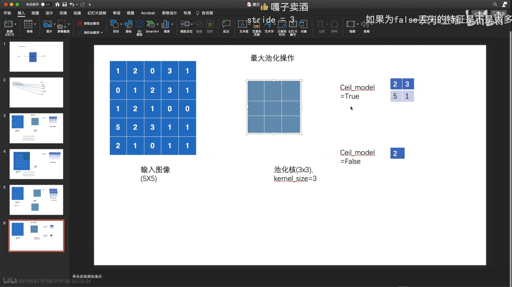

14.embedding（嵌入）是什么？？

**嵌入是将某些数据对象表示为向量，其构造使得数据对象的某些属性被编码到其向量表示的几何属性中。**

**嵌入背后的理论甚至并不复杂：它所涉及的只是从数据对象到高维向量空间中的点的映射，让具有共同属性的事物聚集在一起，相似事物有相近的向量数值。**

机器学习模型只接受数值组作为输入，字符或者图片首先需要转化成数值组，才能进入模型。**常用的转化方式**有3种：One-hot编码，整数编码，嵌入（Embedding）的方法。

**One-hot编码**是最常用的特征表示方法，优点是简单，但是随着特征空间的变大维度爆炸，而且无法学习到词语间的联系。
**整数编码**（编码数值本身无含义，具有误导性。
**嵌入的**方法，通过学习构造一个低维、稠密的向量，可以更好地学习到字符的表示。常见的框架有，Word2Vec（基于浅窗口的方法）, fasttext（基于浅窗口的方法）, GloVe（矩阵分解方法+窗口方法）等方式。**在表示学习后，相似的词汇在向量空间中是比较的距离接近的。

15.output = torch.reshape(output, (-1, 3, 30, 30))，对output进行调整，调整为（batch_size,3,30,30)即每次处理样本的数量；通道数（RGB)即红色、绿色和蓝色）；高度；宽度。-1表示计算机自己计算推断batch_size的大小

16.torch.Size([1, 1, 2, 2])即每次处理样本的数量；通道数；高度；宽度。-1表示计算机自己计算推断batch_size的大小。。。。对于灰度图像来说，通常只有一个通道；对于彩色图像，通道数通常为3（RGB）。

17.激活函数（非线性函数）Relu，默认为False，保留原始数据。。Relu=max(0,input)

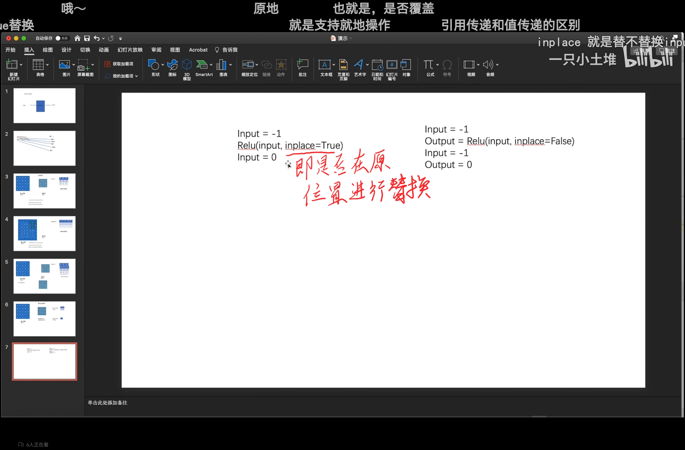

18归一化和正则化？

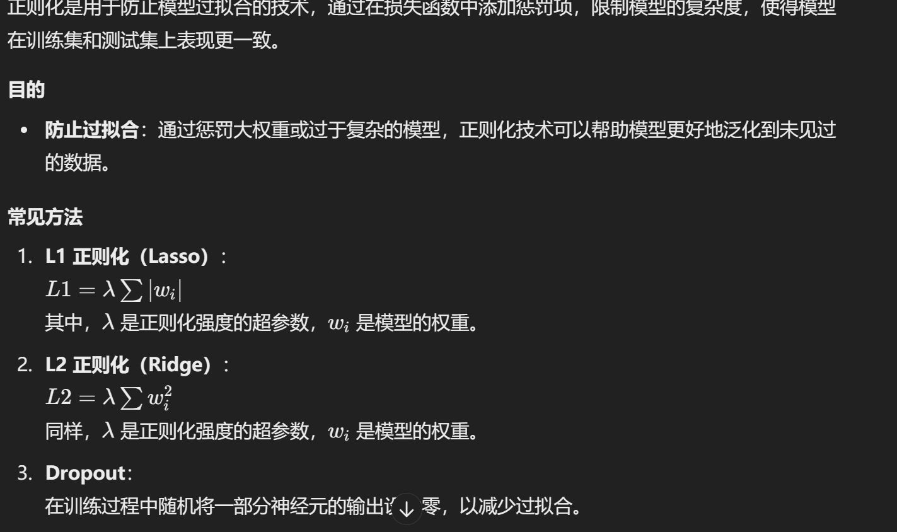

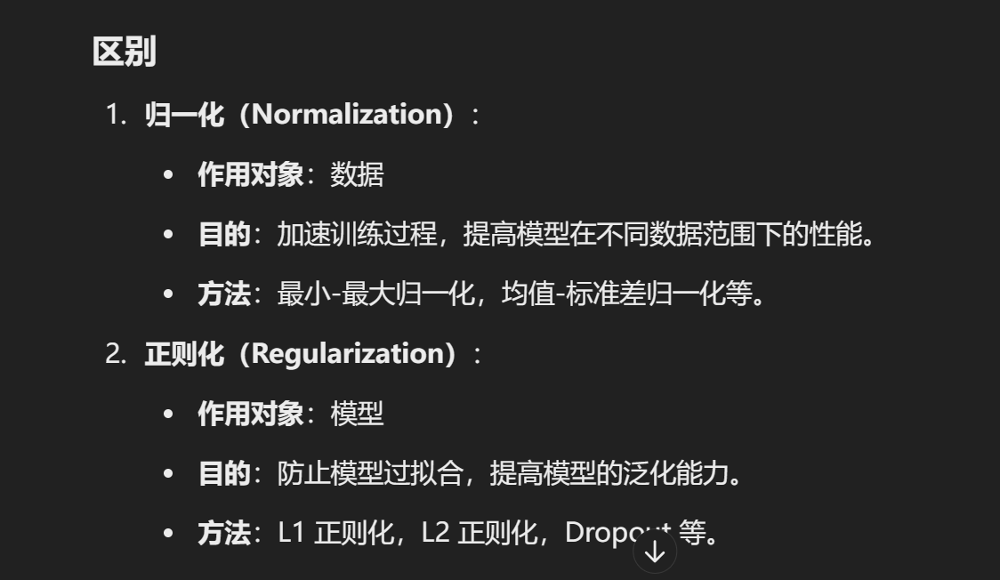

19.in_channel和in_feature?

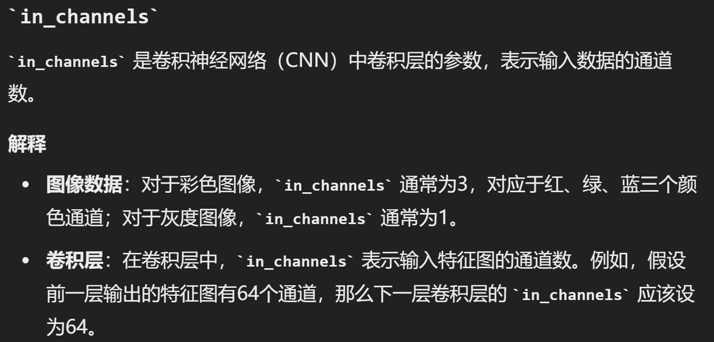

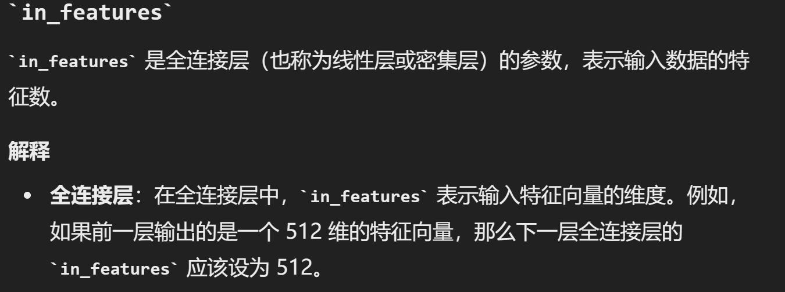

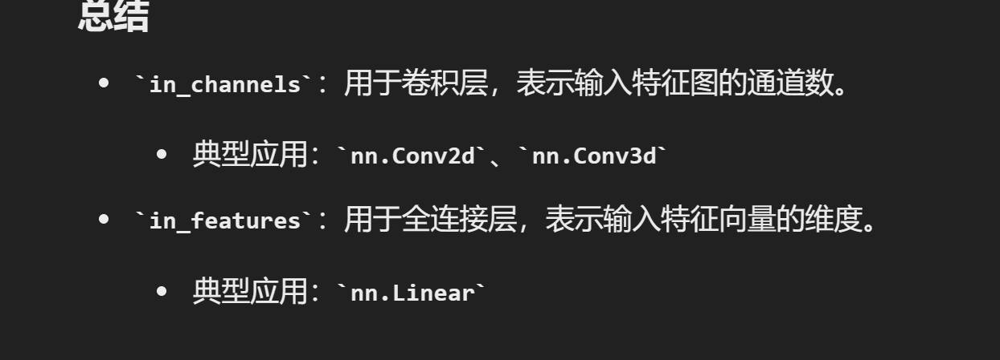

20常见的几种优化器，几种损失函数，激活函数（非线性），线性函数

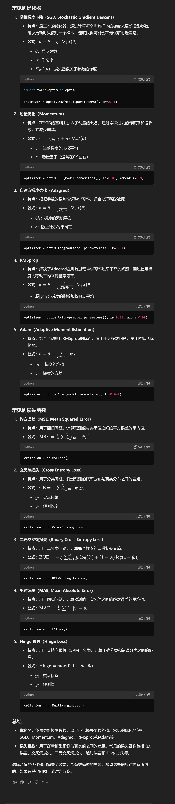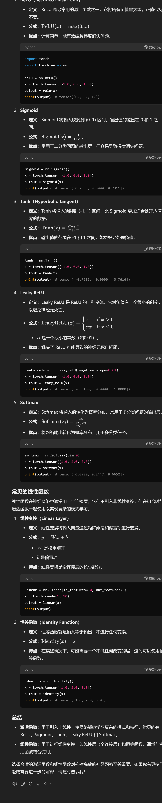

21参数和权重的区别

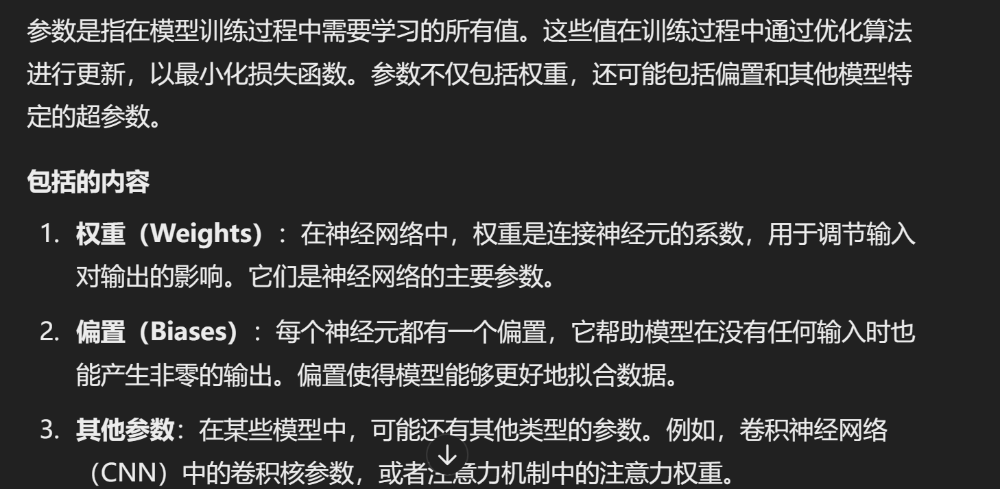

22预训练是什么？

预训练模型是指在大量数据上预先训练过的模型，这些模型可以用于解决各种任务。它们通常用于迁移学习（Transfer Learning），在特定任务中作为起点或基础进行进一步的调整和优化
